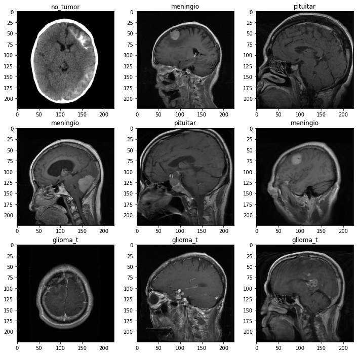
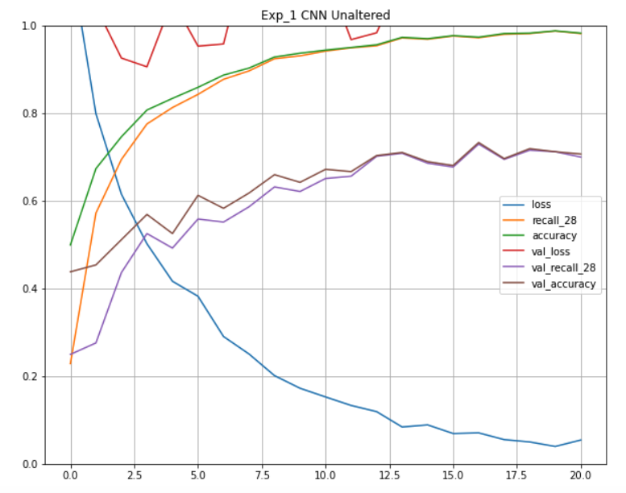
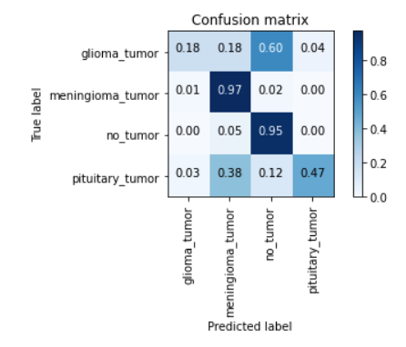
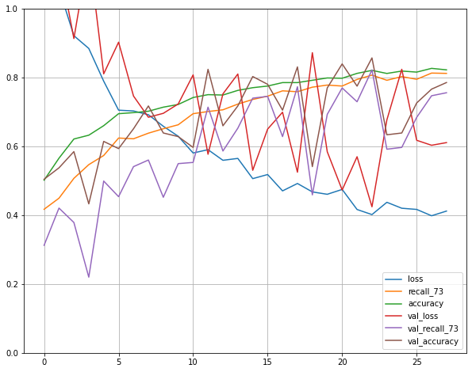

# Brain_tumor_classifer

# 

**Authors**: Jacob Heyman


## Overview
11,700 people are diagnosed with brain tumors every year. Early and accurate detection is a big factor in increasing the life expectancy of the patients diagnosed with the tumors. Diagnosing brain tumors requires extensive imaging and expert visual analysis by highly trained individuals. Often times a neurosurgeon is needed to work alongside the radiologist to properly identify the tumors and classify the tumor type, such as pituitary, glioma or menigioma. Due to the large amount of imaging data produce, a Machine Learning algorithm can be used to classify the images with high accuracy. A properly trained model could help reduce human error in tumor identification and act as a preliminary tumor diagnosis. The classification model could also be used to improve the quality of analysis in underprivliged or emerging countries that do not have the same access to the higher standards of medicine.  

In this study I attempt to create a MRI tumor segmentation classifer that classifies images by the type of tumor.  Using a kaggle dataset of tumor MRI images, I created several convoluted nueral networks (CNN) to train a model on the key features of each tumor class.  My goal of the project is to reduce as many false negative classifications as possible in order for the model to act as a preliminary diagnosis tool. A model with a high recall will prevent the missclassification of specific tumor types and most importantly prevent any tumor being classified as no tumor. 


## Bussiness Problem 
MRI imaging is an essential step in diagnosing and categroizing types of tumors in patients.  Too image brain tumors with an MRI, hundreds of images are produced for an individual patient.  These images need expert analysis from a radiologist and a neurologist to identify and determine the type of tumor.  This process is time consuming and relies on the access to the high calibur doctors. To expediate diagnosis and broaden the accesability of accurate classification, a properly trained CNN can be used to classify different types of tumors and act as a preliminary diagnosostic tool.  In this study I plan to answer the following questions:
 1. Can a CNN classify tumors into four classes (glioma tumors, menigioma tumors, pituitary tumors and no tumors)
 2. What CNN architecture reduces the highest amount of false negatives/ has the highest recall
 3. What are the key features of each tumor class that is identified by the classification CNN


## Data
The Data is sourced from the Kaggle Brain Tumor Classification DataSet.  

The Dataset came pre split into train and test folders, with labled images for four tumor classes:
    
    - Glioma Tumor
        - Cancer of the glial cells.  Are the most common types of primary brain tumors 
    - No Tumor
        - Healty Brain images
    - Meningioma Tumor
        - Cancer in the meninges, the membrane around the brain.  Slow growing with fewer symptoms than other types of tumors.
    _ Pituitary Tumors
        - Cancer in the pituitary gland.  Most are benign but can influence the production of certain hormones.




## Data Understanding: Exploratory Data Analysis
There was significant class imbalance for the no tumor class in the image dataset.  Image augmentation was used to double the no tumor set with horizontally fliped images.  The images where then seuperated by class to observe distinct key features.  Glioma tumors had distinctive assymetry in the brain.  Menigioma tumors appeared as large high pixel intestity clusters between the brain and the skull.  Pituitary tumors appear as high intensity clusters in the pituitary gland located below the hypothalamus(behind the bridge of the nose).  No tumor class images appear to have relativly symetrical brain tissue.   To exacerbate the high intensity feature of the pituitary and menigioma classes, image augmentation was used to brighten the images and double the total dataset.  

## Methods
Modeling: 
Four different CNN's where used to create classification models for three seperate datasets(unaltered, class balanced and brightened).
    
    1. Basic CNN: 3 convolutional layers with maxpooling and 1 dense layer of 32 neurons with an activation layer of softmax.
    2. Exp_1 CNN: 3 convolutional layers with filter sizes (16x16),(8,8),(2,2), with one maxpooling layer and 2 average pooling layers.  2 dense layeers with 1032 neurons and an activation layer with softmax.
    3. AlexNet: Transfer learning model. 
    4. Exp_2 CNN: 4 convolutional layers with maxpooling and increasing dropout.  2 dense layers with 300 neurons and dropout with an activation layer with softmax
    
Each models loss curve was plotted along with a confusion matrix to observe true positives for each class.
    


## Results

The model with the best overall metrics was the experimental model 1 using unaltered data:
The model had an accuracy of 70% and a recall of 69%





A model using AlexNet architecture and the brightened dataset produced the highest true positives for the pituitary tumor class.
The had an accuracy of 67.5% and a recall of 60%




## Conclusions

The goal of this project was to create a model that could act as a preliminary tumor diagnostic tool. The trained model would greatly increase the accessibility of quality MRI image analysis and reduce the time needed to process MRI images. In my modeling process the best model was an AlexNet using augmented data that had been brightened in order to highlight the hyperintensity of tumors in the MRI images. The bright alexnet model had a Recall of 60% and an accuracy of 67.5%. While other models had better test recall and accuracy metrics, the bright AlexNet had the highest spread of true positive predictions for each class, particularly the pituitary tumor class which had low true positives in many of the other models. The marginal drop in true positives for the meningioma and no tumor class, may be a direct result from the brightening augmentation. The augmentation appears to brighten the skull significantly, and this might affect the classifiers ability to detect certain meningiomas since they occur between the skull and the brain. The increase in no tumor images being classified as meningiomas and vice versa seems to fit this theory. To address this issue, I will reduce the intensity of the brightness augmentation, and maybe introduce darkened images as well.

In addition to training models with the bright dataset I also created a class balanced dataset. The balanced dataset performed poorly on each model and seemed to negatively affect the overall metrics. For the next steps of this study, I will exclude this dataset from any additional CNN architectures I use for classification.

All models were relatively weak at predicting the glioma tumor class. By observing a positive classification of a glioma image, I found that the model may be making predictions on the asymmetry of the brain for the glioma tumor class. For the next steps in the modeling process, I will attempt additional augmentations to exacerbate the asymmetry and aid the model in true positives for the glioma class.

In order to produce a usable diagnostic tool, more work is needed to increase the predictive power of the model. Additional research into alternative augmentations and CNN structures is needed in order to reduce the false negatives in the model, particularly in the glioma tumor class.


  
## Next Steps
To further improve the tumor classification model some possible next steps inclue:

- Add flip and zoomed image augmentation to capture assymetry in glioma images
- Reduce the brightness used in the brightened imageset and introduce darkened images to help with the classification of menigioma tumors
- Tune the alexnet architecture to address overfitting


 

## For More Information


## Repository Structure

```
├──                            <- 
├──           <- 
├──                <- 
├──        <- 
├──              <-        
├─                              <- 
└──                 <- 